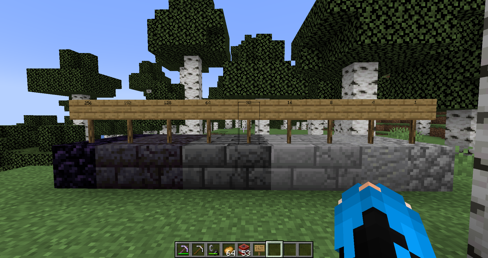

# MinecraftTntPlugin

## How to Use
Move the TntPlugin.jar in the pugin folder in your sever of choice

---

## Features

Rocks have set hardness as show below.

When there are broken either by tnt or player 
they move down a rank and drop a crafting matrial.

They can then be added back into the rock equal to the diffrence in hardness to go up a rank.

Using a potato will show the current hardness.